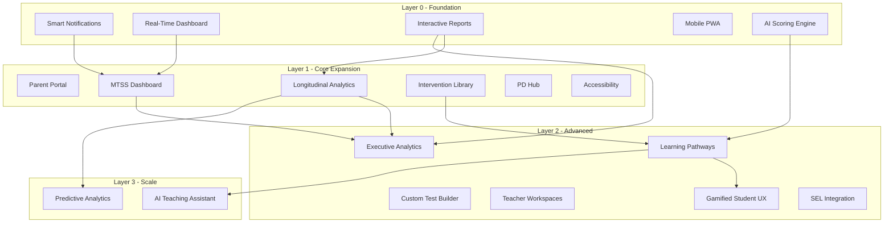

# LDG Roadmap POC Implementation

## Scope

**19 features implemented** (POC-grade, functional demos with real data)

**9 features skipped** (require infrastructure: #1 SSO, #9 LMS/SIS, #16 Multi-Language ASR, #19 API Marketplace, #22 Blockchain, #23 PreK/9-12 Norming, #25 Research Data, #27 White-Label, #28 International)

## Architecture Overview

All features build on the existing React + FastAPI + SQLite stack. New features add:

- 7 new frontend pages/tabs
- 5 new backend routers
- 4 new database tables
- Enhanced seed data

---

## Batch 1: Foundation (Layer 0) -- 5 features

### #2 Smart Notifications

- **Backend**: New `Notification` model (id, user_id, type, title, message, link, is_read, created_at). New `notifications_router.py` with GET /list, POST /mark-read, POST /mark-all-read. Add a `NotificationEngine` service that generates alerts on startup/seed: untested students, risk changes, license warnings, benchmark deadlines.
- **Frontend**: Bell icon in `Layout.jsx` sidebar with unread count badge. Dropdown panel showing notifications grouped by type. Click navigates to relevant page. Mark-read on click. "Mark all read" button. Notification preferences toggle in user settings.
- **Seed data**: Generate 20-50 notifications per user covering all 6 types.

### #3 Real-Time Dashboard Enhancements

- **Frontend** (`Dashboard.jsx`): Add 3 new sections:

  1. **Risk Heatmap**: Grid of grade x subtest cells, color-coded by % high risk (green/yellow/red), clickable to drill into Reports.
  2. **Today's Testing Queue**: Priority-sorted list of students to assess next (factors: days since last test, risk level, upcoming deadlines). One-click "Start Assessment" button per student.
  3. **Completion Tracker**: Progress bars per grade showing X/Y students tested this window. Behind-schedule warning for <80% completion.

- **Backend**: New endpoint `GET /api/reports/testing-queue` returning prioritized student list. New endpoint `GET /api/reports/completion-stats` returning per-grade completion data.

### #4 Interactive Reports Enhancements

- **Frontend** (`Reports.jsx`): Add:

  1. Line charts for score trends over time (BOY→MOY→EOY)
  2. Scatter plot for growth correlations (initial score vs growth)
  3. "Print / PDF" button using `window.print()` with print CSS
  4. Enhanced Excel export with multiple sheets (summary + detail), conditional formatting simulation via CSV with extra columns
  5. Benchmark reference lines on all charts

### #5 Mobile-First PWA (Basic)

- Add `manifest.json` with app name, icons, theme color, display: standalone
- Add basic service worker via Vite PWA plugin for asset caching
- Add responsive improvements to Layout.jsx: collapsible sidebar already exists, ensure all pages work on 375px width
- Add `<meta name="apple-mobile-web-app-capable">` tags

### #6 AI Auto-Scoring Enhancements

- **Backend** (`intelliscore.py`): Add scoring algorithms for additional test types beyond retell:

  1. Reading fluency scoring (CWPM calculation from transcript word count + duration)
  2. Questions scoring heuristic (detect factual recall, inferential reasoning patterns)
  3. Per-test-type analysis that returns different sub_scores based on subtest

- **Frontend**: IntelliScore component already supports subtest prop; enhance analysis display to show test-type-specific breakdowns

---

## Batch 2: Core Expansion (Layer 1) -- 6 features

### #7 Parent Portal

- **Backend**: Add `parent` role to User model. New `parent_router.py`: GET /my-children (students linked to parent), GET /child/{id}/progress (simplified progress). Add `parent_student` association table. Add parent invitation endpoint.
- **Frontend**: New `ParentDashboard.jsx` page: child selector, risk level with plain-language explanation ("Your child is performing at grade level"), simplified trend chart, celebration badges for improvements, at-home activity suggestions (static list).
- **Routing**: If user role is `parent`, redirect to `/parent` instead of `/`. Add `/parent` route.
- **Seed data**: Create 2-3 parent users linked to students.

### #8 MTSS/RTI Dashboard

- **Backend**: New `mtss_router.py`: GET /tier-summary (student counts per tier), GET /tier-history/{student_id} (tier changes over time), POST /intervention-log (log intervention session). New `InterventionLog` model (id, student_id, user_id, date, duration_minutes, intervention_type, fidelity_score, notes). Add tier classification logic: Tier 1 = benchmark/advanced, Tier 2 = moderate, Tier 3 = high risk.
- **Frontend**: New `MTSS.jsx` page with:

  1. **Pyramid visualization**: Tier 1/2/3 triangle showing student counts and percentages
  2. **Student list per tier**: Clickable cards with quick actions (view, log intervention)
  3. **Tier movement tracker**: Timeline showing students who moved between tiers over assessment windows
  4. **Intervention log form**: Date, duration, type, fidelity checklist, notes
  5. **IEP referral button**: Generates downloadable summary document (text-based)

- **Navigation**: Add "MTSS" to sidebar in `Layout.jsx`

### #10 Longitudinal Analytics

- **Backend**: New endpoint `GET /api/reports/longitudinal` returning multi-year student data. New endpoint `GET /api/reports/cohort` for cohort comparison. Growth percentile calculation (simplified: rank-based percentile within grade).
- **Frontend**: New `Longitudinal.jsx` page with:

  1. Student growth trajectory chart (multi-year line chart with benchmark bands)
  2. Cohort builder (filter by grade, school, risk level at entry)
  3. Year-over-year comparison table
  4. Demographic disaggregation (by grade, school)

- **Navigation**: Add "Analytics" to sidebar

### #11 Intervention Library

- **Backend**: New `Intervention` model (id, title, description, skill_area, grade_range_min/max, duration_minutes, materials, evidence_level, instructions). New `interventions_router.py`: GET / (search/filter), GET /{id}, POST /assign (assign to student). New `InterventionAssignment` model.
- **Seed data**: Seed 200+ evidence-based literacy activities across 5 skill areas (phonemic awareness, phonics, fluency, vocabulary, comprehension), grades K-8, durations 10-45 min.
- **Frontend**: New `Interventions.jsx` page: searchable card grid with filters (skill area, grade, duration, evidence level), detail modal, "Assign to Student" action, "Suggested for this student" section on StudentDetail.

### #12 PD Hub

- **Backend**: New models: `PDCourse` (id, title, description, duration_hours), `PDModule` (id, course_id, title, content, quiz_json, order), `PDProgress` (id, user_id, module_id, completed, score, completed_at). New `pd_router.py`: GET /courses, GET /courses/{id}, POST /modules/{id}/complete, GET /my-progress, GET /certificate/{course_id}.
- **Seed data**: 5 courses (Introduction to CUBED-3, Scoring Accuracy, IntelliScore Training, MTSS Basics, Data-Driven Instruction) with 3-5 modules each, quiz questions.
- **Frontend**: New `PDHub.jsx` page: course catalog, module viewer with text content + embedded quiz, progress indicators, certificate generation (downloadable HTML/print).

### #13 Accessibility (WCAG 2.1 AA Basics)

- **Frontend** (cross-cutting, all pages):

  1. Add skip navigation link at top of Layout
  2. Add ARIA landmarks (main, nav, complementary) to Layout
  3. Add aria-labels to all icon-only buttons
  4. Add keyboard focus indicators (visible ring on all interactive elements)
  5. Add high-contrast mode toggle in Layout header (CSS custom properties swap)
  6. Ensure all color-coded risk indicators also have text/shape labels (already partially done)
  7. Add alt text to all images/icons where meaningful

---

## Batch 3: Advanced (Layer 2) -- 6 features

### #14 Learning Pathways (Simplified)

- **Backend**: New `StudentPathway` model (id, student_id, created_at, status). New `PathwayActivity` model (id, pathway_id, intervention_id, order, status, completed_at). New `pathways_router.py`: POST /generate/{student_id} (auto-generate from risk data + intervention library), GET /student/{student_id}, PUT /activities/{id}/complete.
- **Logic**: SkillGapAnalyzer = map high/moderate risk targets to skill areas; InterventionMatcher = find interventions matching those skill areas at student's grade; Sequencer = order by prerequisite → difficulty.
- **Frontend**: New section in `StudentDetail.jsx`: "Learning Pathway" tab showing activity timeline, completion checkboxes, progress bar, "Generate Pathway" button.

### #15 Executive Analytics

- **Backend**: New `executive_router.py`: GET /scorecard (district-level KPIs), GET /school-comparison (per-school metrics). Aggregation queries across all students.
- **Frontend**: New `Executive.jsx` page (admin-only): District scorecard cards (overall proficiency, growth, completion rate), school comparison bar chart (ranked by proficiency), year-over-year trend, risk tier distribution comparison across schools.

### #17 Custom Test Builder (Simplified)

- **Backend**: New models: `TestItem` (id, stem, response_type, answer_key, skill_area, grade, difficulty), `CustomTest` (id, name, created_by, items JSON). New `test_builder_router.py`: CRUD for items and tests.
- **Frontend**: New `TestBuilder.jsx` page: item bank table with filters, "Create Test" wizard (name → add items from bank → preview → save), drag-to-reorder items.

### #18 Teacher Workspaces

- **Backend**: New models: `Workspace` (id, name, type, owner_id), `WorkspaceMember`, `WorkspaceNote` (id, workspace_id, student_id, user_id, content, created_at). New `workspaces_router.py`: CRUD workspace, add members, add/list notes.
- **Frontend**: New `Workspaces.jsx` page: workspace list, create/manage workspace, shared student data table, annotation/comment thread per student, action items checklist.

### #20 Gamified Student UX

- **Backend**: New models: `Badge` (id, name, description, criteria, icon), `StudentBadge` (student_id, badge_id, earned_at), `ReadingStreak` (student_id, current_streak, longest_streak, last_activity_date). New `gamification_router.py`. Badge engine: auto-award badges on assessment milestones.
- **Seed data**: Define 15+ badges (First Assessment, 5-Day Streak, Risk Reducer, Perfect Score, etc.). Seed streaks and badge awards.
- **Frontend**: New `StudentProfile.jsx` page (student-facing view): avatar display, badge gallery, streak calendar heatmap, progress stats.

### #21 SEL Integration

- **Backend**: New models: `SELScreening` (id, student_id, screener_id, date, self_awareness, self_management, social_awareness, relationship_skills, decision_making, total_score, risk_level). New `sel_router.py`: POST /screenings, GET /student/{id}, GET /class-summary.
- **Seed data**: Generate SEL screenings for ~30% of students with correlated risk levels.
- **Frontend**: New `SEL.jsx` page: screening form, radar chart for competency profile, class climate dashboard, SEL + literacy correlation scatter plot.

---

## Batch 4: Scale (Layer 3) -- 2 features

### #24 Predictive Analytics (Simplified)

- **Backend**: New `predictions_router.py`: GET /at-risk-predictions. Simple prediction logic: students with declining scores across BOY→MOY→EOY, combined with current high/moderate risk and low growth rate, get flagged as "predicted at risk in 6 months" with contributing factors.
- **Frontend**: New `Predictions.jsx` page: early warning table with risk probability (High/Medium/Low), contributing factors list per student, watch list management (star/unstar), filter by classroom/grade/confidence.

### #26 AI Teaching Assistant (Simplified)

- **Backend**: New `assistant_router.py`: POST /ask (receives natural language query, returns structured response). Template-based response engine (not LLM): parse intent from keywords → query database → format response. Intents: "which students need X", "group students by Y", "what to focus on with [student]", "show progress for [student]".
- **Frontend**: New chat panel component (slide-out drawer): text input, message history, structured responses (tables, student cards, charts), suggested queries.

---

## New Files Summary

### Backend (new files)

- `routers/notifications_router.py`
- `routers/mtss_router.py`
- `routers/interventions_router.py`
- `routers/pd_router.py`
- `routers/pathways_router.py`
- `routers/executive_router.py`
- `routers/test_builder_router.py`
- `routers/workspaces_router.py`
- `routers/gamification_router.py`
- `routers/sel_router.py`
- `routers/predictions_router.py`
- `routers/assistant_router.py`
- `routers/parent_router.py`
- `services/notification_engine.py`
- `services/pathway_engine.py`
- `services/prediction_engine.py`
- `services/assistant_engine.py`

### Frontend (new files)

- `src/pages/MTSS.jsx`
- `src/pages/Longitudinal.jsx`
- `src/pages/Interventions.jsx`
- `src/pages/PDHub.jsx`
- `src/pages/Executive.jsx`
- `src/pages/TestBuilder.jsx`
- `src/pages/Workspaces.jsx`
- `src/pages/SEL.jsx`
- `src/pages/Predictions.jsx`
- `src/pages/ParentDashboard.jsx`
- `src/pages/StudentProfile.jsx` (student-facing gamified view)
- `src/components/NotificationBell.jsx`
- `src/components/AIAssistant.jsx`
- `src/components/RiskHeatmap.jsx`
- `src/components/TestingQueue.jsx`
- `src/components/CompletionTracker.jsx`

### Modified files

- `backend/models.py` -- 10+ new tables
- `backend/main.py` -- register new routers
- `backend/seed_data.py` -- seed new data types
- `frontend/src/services/api.js` -- new API methods
- `frontend/src/App.jsx` -- new routes
- `frontend/src/components/Layout.jsx` -- new nav items, notification bell, accessibility, high-contrast
- `frontend/src/pages/Dashboard.jsx` -- heatmap, queue, completion tracker
- `frontend/src/pages/Reports.jsx` -- new chart types, enhanced export
- `frontend/src/pages/StudentDetail.jsx` -- learning pathway tab, SEL tab
- `frontend/src/components/IntelliScore.jsx` -- enhanced per-test-type scoring

---

## Implementation Order

Features are implemented in batch order (Layer 0 first, then Layer 1, etc.). Within each batch, features are independent and can be built sequentially. After each feature, we verify:

1. No lint errors
2. Page loads correctly
3. Data displays from seed data
4. Key interactions work (click, filter, navigate)

## Skipped Features (require real infrastructure)

- #1 SSO Expansion (Google/Microsoft/ClassLink/SAML OAuth providers)
- #9 LMS/SIS Deep Integrations (Canvas/Schoology/PowerSchool APIs + vendor certifications)
- #16 Multi-Language ASR (fine-tuned Whisper per language, real translation)
- #19 Open API & Marketplace (API gateway, Stripe billing, developer portal)
- #22 Blockchain Credentials (Polygon smart contracts, IPFS)
- #23 PreK & 9-12 Expansion (norming studies, field testing, psychometric validation)
- #25 Research Data Platform (IRB compliance, de-identification pipeline)
- #27 White-Label Platform (multi-tenant architecture refactor)
- #28 International Framework (CDN, GDPR, multi-currency, country curricula)